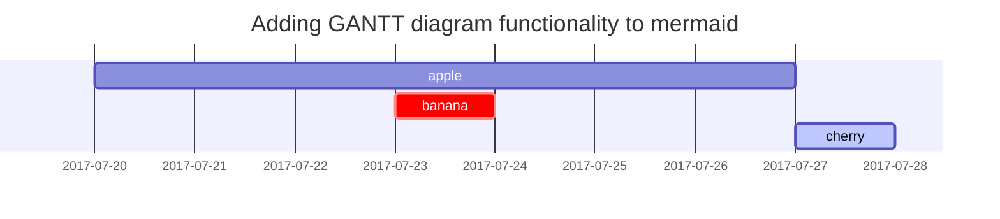

> 브라우저의 개발자 도구만을 사용하여 웹 애플리케이션의 보안 취약점을 수동으로 분석합니다. <br> 별도의 도구나 스크립트 없이, 오직 브라우저만으로 수행하는 해킹 기법을 다룹니다.
{: .prompt-info }

# 웹 애플리케이션 탐색하기
이 내용은 브라우저에 기본적으로 포함된 개발자 도구만을 사용하여 웹 애플리케이션의 보안 취약점을 수동으로 분석하는 방법을 학습하는 과정이다. 자동화된 보안 도구나 스크립트는 많은 취약점과 중요한 정보를 놓칠 수 있기 때문에, 직접 웹 애플리케이션을 탐색하고 동작을 분석하는 능력이 중요하다는 점을 강조한다.

실습에서는 브라우저의 내장 도구들을 활용한다.
- View Source 기능은 웹사이트의 사람이 읽을 수 있는 HTML 소스 코드를 확인할 때 사용된다. 이를 통해 숨겨진 주석, 링크, 입력값 처리 방식 등의 정보를 확인할 수 있다.

- Inspector 도구는 페이지 요소를 직접 분석하고 수정하는 기능이다. HTML 구조와 CSS 속성을 확인할 수 있으며, 화면에서 숨겨진 요소를 강제로 표시하거나 차단된 콘텐츠를 확인하는 데 활용된다.

- Debugger는 JavaScript 코드의 실행 흐름을 분석하고 제어하는 기능이다. 브레이크포인트를 설정하여 코드가 어떻게 동작하는지 확인할 수 있으며, 클라이언트 측 검증 로직이나 숨겨진 기능을 분석할 때 유용하다.

- Network 도구는 웹페이지가 서버와 주고받는 모든 네트워크 요청을 확인하는 기능이다. HTTP 요청 및 응답, API 통신, 전달되는 데이터 등을 분석할 수 있으며, 인증 정보나 민감한 데이터가 노출되는지 확인하는 데 사용된다.

실습 환경은 가상 머신 기반으로 제공되며, “Start Machine” 버튼을 눌러 머신을 실행한 뒤 일정 시간이 지나면 제공되는 URL을 통해 대상 웹 애플리케이션에 접속하여 분석을 진행하게 된다.

# 웹사이트 탐색
침투 테스터로서 웹사이트나 웹 애플리케이션을 검토할 때의 역할은, 잠재적으로 취약할 수 있는 기능들을 찾아내고 실제로 이를 악용(Exploit)해 보면서 실제 취약 여부를 평가하는 것입니다. 이러한 기능들은 일반적으로 사용자와의 상호작용이 필요한 웹사이트의 일부입니다.

웹사이트의 상호작용 요소를 찾는 방법은 로그인 폼을 발견하는 것처럼 간단할 수도 있고, 웹사이트의 JavaScript를 수동으로 분석하는 방식일 수도 있습니다. 가장 좋은 시작 방법 중 하나는 브라우저만 사용하여 웹사이트를 직접 탐색하면서, 각 페이지·영역·기능을 정리하고 간단한 요약을 기록하는 것입니다.

예를 들어, Acme IT Support 웹사이트를 검토했다면 사이트 리뷰는 다음과 같은 형태가 될 수 있습니다:
| Feature | URL | Summary |
|:---|:---|:---|
| Home Page | `/` | This page contains a summary of what Acme IT Support does with a company photo of their staff. |
| Latest News | `/news` | This page contains a list of recently published news articles by the company, and each news article has a link with an ID number, e.g. `/news/article?id=1`. |
| News Article | `/news/article?id=1` | Displays the individual news article. Some articles seem to be blocked and reserved for premium customers only. |
| Contact Page | `/contact` | This page contains a form for customers to contact the company. It contains name, email, and message input fields with a send button. |
| Customers | `/customers` | This link redirects to `/customers/login`. |
| Customer Login | `/customers/login` | This page contains a login form with username and password fields. |
| Customer Signup | `/customers/signup` | This page contains a user signup form that consists of username, email, password, and password confirmation input fields. |
| Customer Reset Password | `/customers/reset` | Password reset form with an email address input field. |
| Customer Dashboard | `/customers` | This page contains a list of the user's tickets submitted to the IT support company and a "Create Ticket" button. |
| Create Ticket | `/customers/ticket/new` | This page contains a form with a textbox for entering the IT issue and a file upload option to create an IT support ticket. |
| Customer Account | `/customers/account` | This page allows the user to edit their username, email, and password. |
| Customer Logout | `/customers/logout` | This link logs the user out of the customer area. |

# 페이지 소스 코드 확인
{: .mt-4 .mb-0 }

# 개발자 도구 - 요소 검사(Inspector)
{: .mt-4 .mb-0 }

# 개발자 도구 - 디버거
{: .mt-4 .mb-0 }

# 개발자 도구 - 네트워크
{: .mt-4 .mb-0 }

### H3 — heading
{: .mt-4 .mb-0 }

#### H4 — heading
{: .mt-4 .mb-0 }
<!-- markdownlint-restore -->

## Paragraph

Quisque egestas convallis ipsum, ut sollicitudin risus tincidunt a. Maecenas interdum malesuada egestas. Duis consectetur porta risus, sit amet vulputate urna facilisis ac. Phasellus semper dui non purus ultrices sodales. Aliquam ante lorem, ornare a feugiat ac, finibus nec mauris. Vivamus ut tristique nisi. Sed vel leo vulputate, efficitur risus non, posuere mi. Nullam tincidunt bibendum rutrum. Proin commodo ornare sapien. Vivamus interdum diam sed sapien blandit, sit amet aliquam risus mattis. Nullam arcu turpis, mollis quis laoreet at, placerat id nibh. Suspendisse venenatis eros eros.

## Lists

### Ordered list

1. Firstly
2. Secondly
3. Thirdly

### Unordered list

- Chapter
  - Section
    - Paragraph

### ToDo list

- [ ] Job
  - [x] Step 1
  - [x] Step 2
  - [ ] Step 3

### Description list

Sun
: the star around which the earth orbits

Moon
: the natural satellite of the earth, visible by reflected light from the sun

## Block Quote

> This line shows the _block quote_.

## Prompts

<!-- markdownlint-capture -->
<!-- markdownlint-disable -->
> An example showing the `tip` type prompt.
{: .prompt-tip }

> An example showing the `info` type prompt.
{: .prompt-info }

> An example showing the `warning` type prompt.
{: .prompt-warning }

> An example showing the `danger` type prompt.
{: .prompt-danger }
<!-- markdownlint-restore -->

## Tables

| Company                      | Contact          | Country |
| :--------------------------- | :--------------- | ------: |
| Alfreds Futterkiste          | Maria Anders     | Germany |
| Island Trading               | Helen Bennett    |      UK |
| Magazzini Alimentari Riuniti | Giovanni Rovelli |   Italy |

## Links

<http://127.0.0.1:4000>

## Footnote

Clicking the hook will locate the footnote[^footnote], and here is another footnote[^fn-nth-2].

## Inline code

This is an example of `Inline Code`.

## Filepath

Here is the `/path/to/the/file.extend`{: .filepath}.

## Code blocks

### Common

<!-- markdownlint-disable-next-line MD040 -->
```
This is a common code snippet, without syntax highlight and line number.
```

### Specific Language

```bash
if [ $? -ne 0 ]; then
  echo "The command was not successful.";
  #do the needful / exit
fi;
```

### Specific filename

```sass
@import
  "colors/light-typography",
  "colors/dark-typography";
```
{: file='_sass/jekyll-theme-chirpy.scss'}

## Mathematics

The mathematics powered by [**MathJax**](https://www.mathjax.org/):

$$
\begin{equation}
  \sum_{n=1}^\infty 1/n^2 = \frac{\pi^2}{6}
  \label{eq:series}
\end{equation}
$$

We can reference the equation as \eqref{eq:series}.

When $a \ne 0$, there are two solutions to $ax^2 + bx + c = 0$ and they are

$$ x = {-b \pm \sqrt{b^2-4ac} \over 2a} $$

## Mermaid SVG



## Images

### Default (with caption)

{: width="972" height="589" }
_Full screen width and center alignment_

### Left aligned

{: width="972" height="589" .w-75 .normal}

### Float to left

{: width="972" height="589" .w-50 .left}
Praesent maximus aliquam sapien. Sed vel neque in dolor pulvinar auctor. Maecenas pharetra, sem sit amet interdum posuere, tellus lacus eleifend magna, ac lobortis felis ipsum id sapien. Proin ornare rutrum metus, ac convallis diam volutpat sit amet. Phasellus volutpat, elit sit amet tincidunt mollis, felis mi scelerisque mauris, ut facilisis leo magna accumsan sapien. In rutrum vehicula nisl eget tempor. Nullam maximus ullamcorper libero non maximus. Integer ultricies velit id convallis varius. Praesent eu nisl eu urna finibus ultrices id nec ex. Mauris ac mattis quam. Fusce aliquam est nec sapien bibendum, vitae malesuada ligula condimentum.

### Float to right

{: width="972" height="589" .w-50 .right}
Praesent maximus aliquam sapien. Sed vel neque in dolor pulvinar auctor. Maecenas pharetra, sem sit amet interdum posuere, tellus lacus eleifend magna, ac lobortis felis ipsum id sapien. Proin ornare rutrum metus, ac convallis diam volutpat sit amet. Phasellus volutpat, elit sit amet tincidunt mollis, felis mi scelerisque mauris, ut facilisis leo magna accumsan sapien. In rutrum vehicula nisl eget tempor. Nullam maximus ullamcorper libero non maximus. Integer ultricies velit id convallis varius. Praesent eu nisl eu urna finibus ultrices id nec ex. Mauris ac mattis quam. Fusce aliquam est nec sapien bibendum, vitae malesuada ligula condimentum.

### Dark/Light mode & Shadow

The image below will toggle dark/light mode based on theme preference, notice it has shadows.

{: .light .w-75 .shadow .rounded-10 w='1212' h='668' }
{: .dark .w-75 .shadow .rounded-10 w='1212' h='668' }

## Video



## Reverse Footnote

[^footnote]: The footnote source
[^fn-nth-2]: The 2nd footnote source
